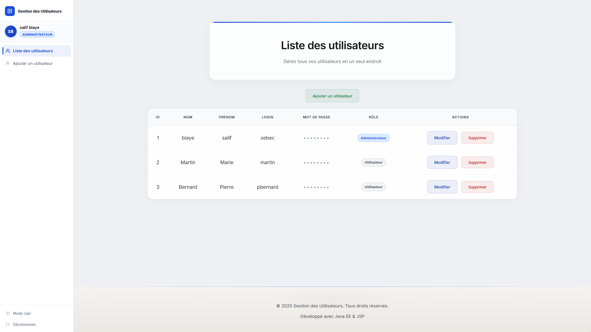
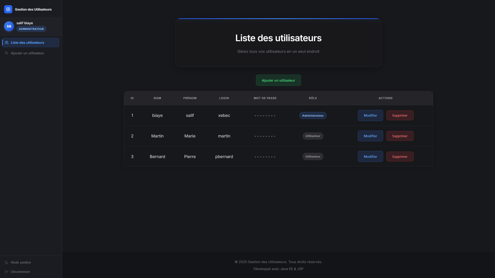

# GesUsers2 — Gestion des Utilisateurs

> Application web Java EE de gestion d'utilisateurs avec authentification, CRUD complet, gestion des rôles et thèmes light/dark.


---

## Screenshots

### Mode Clair — Liste des utilisateurs (Administrateur)


### Mode Sombre


---

## Fonctionnalités

### Authentification & Sécurité
- Connexion sécurisée (login / mot de passe)
- `AuthenticationFilter` — protection de toutes les routes sensibles
- Redirection automatique vers `/list` si déjà connecté
- Session invalidée à la déconnexion (thème conservé)

### Gestion des Rôles (Bonus)
| Fonctionnalité | Administrateur | Utilisateur |
|---|:---:|:---:|
| Voir la liste | ✅ | ✅ |
| Ajouter un utilisateur | ✅ | ❌ |
| Modifier un utilisateur | ✅ | ❌ |
| Supprimer un utilisateur | ✅ | ❌ |
| Lien "Ajouter" dans la sidebar | ✅ | masqué |
| Boutons Modifier / Supprimer | ✅ | masqués |

### CRUD Utilisateurs
- **Créer** — formulaire avec validation serveur, confirmation du mot de passe
- **Lire** — tableau paginé avec badges de rôle
- **Modifier** — pré-remplissage du formulaire, choix du rôle
- **Supprimer** — modal de confirmation

### UI / UX
- Thème **Light** et **Dark** (`rgb(23, 24, 28)`) switchable en un clic
- Icône thème dynamique (☀️ mode clair / 🌙 mode sombre)
- Sidebar avec avatar (initiales), nom complet, badge rôle coloré
- Validation côté serveur avec messages d'erreur en français

---

## Architecture

```
Architecture 3 Tiers — MVC
┌─────────────────────────────────────────────────┐
│  ① Présentation   Servlet (Controller) + JSP    │
│  ② Métier         UserService · AuthService     │
│  ③ Données        DAO (MySQL JDBC / in-memory)  │
└─────────────────────────────────────────────────┘
```

**Patterns de conception :** MVC · DAO · Service Layer · Filter · Strategy

```
src/main/java/
├── beans/           → Utilisateur.java (id, nom, prenom, login, password, role)
├── dao/             → UtilisateurDao.java · UtilisateurDaoBdd.java
├── service/         → UserService.java · AuthenticationService.java
├── web/controller/  → AddUserServlet · UpdateUserServlet · RemoveUserServlet
│                      ListUserServlet · AuthenticationController · ThemeController
├── web/form/        → AbstractUserForm · AddUserForm · UpdateUserForm
├── mapper/          → UserMapper.java
└── filter/          → AuthenticationFilter.java

src/main/webapp/
├── WEB-INF/         → JSP (login, liste, ajouter, modifier)
├── inc/             → header.jsp · footer.jsp
└── css/             → light/ · dark/
```

---

## Stack Technique

| Composant | Technologie | Version |
|-----------|-------------|---------|
| Langage | Java | 17 |
| Framework | Jakarta EE | 6.1 |
| Servlets | Jakarta Servlet API | 6.1 |
| Vues | JSP + JSTL | 2.0 |
| Serveur | Apache Tomcat | 11.0 |
| Base de données | MySQL | 8.0 |
| Build | Apache Ant | — |
| Conteneurs | Docker Compose | — |

---

## Démarrage Rapide

### Prérequis
- Java 17+
- Apache Tomcat 11
- Docker & Docker Compose (pour MySQL)
- Apache Ant

### 1. Lancer la base de données

```bash
docker compose up -d
# MySQL sur :3306 · Adminer (GUI) sur http://localhost:8081
# Connexion Adminer : server=mysql, user=root, pass=passer123, db=gesusers
```

### 2. Initialiser le schéma

```sql
-- Exécuter init.sql dans Adminer ou via MySQL CLI
source init.sql
```

### 3. Compiler et déployer

```bash
ant deploy
# WAR déployé sur Tomcat → http://localhost:8080/gesusers2
```

---

## Comptes de test

| Login | Mot de passe | Rôle |
|-------|-------------|------|
| `jdupont` | `password123` | **Administrateur** |
| `mmartin` | `password456` | Utilisateur |
| `pbernard` | `password789` | Utilisateur |

---

## Base de Données

```sql
CREATE TABLE utilisateur (
    id        INT PRIMARY KEY AUTO_INCREMENT,
    nom       VARCHAR(255),
    prenom    VARCHAR(255),
    login     VARCHAR(255) UNIQUE NOT NULL,
    password  VARCHAR(255),
    role      VARCHAR(50) NOT NULL DEFAULT 'user'
);
```

---

## Docker

```yaml
# docker-compose.yml
services:
  mysql:   image: mysql:8.0   # port 3306
  adminer: image: adminer      # port 8081 — interface graphique BDD
```

---

## Développé avec

**Java EE · Jakarta Servlet · JSP · JSTL · MySQL · Docker · Apache Ant · Tomcat 11**

---

*Salif Biaye — 2025*
